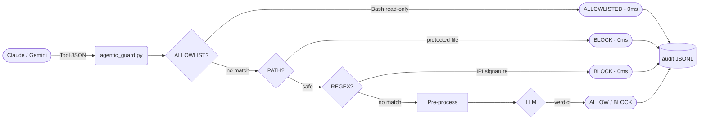

# Agentic Security — Architecture Reference

This document provides the technical specification for the Agentic Security Monitor. For the project goals and roadmap, see [PLAN.md](PLAN.md).

---

## 1. System Data Flow
The monitor intercepts tool calls and responses from both **Claude Code** and **Gemini CLI**, routing them through a multi-stage security funnel.



---

## 2. Guard Pipelines

The monitor uses an **Architectural Split** to distinguish between active commands and passive content analysis.

### 2.1 Action Guard
- **Trigger**: `PreToolUse` (Claude) or `BeforeTool` (Gemini).
- **Primary Goal**: Prevent destructive commands, exfiltration, and unauthorized system modification.
- **Fast-Path**: Safe, read-only commands (e.g., `git log`, `ls`) are **ALLOWLISTED** to minimize latency.

### 2.2 Injection Guard
- **Trigger**: `PostToolUse` (Claude) or `AfterTool` (Gemini).
- **Primary Goal**: Detect Indirect Prompt Injections (IPI) hidden in source code, logs, or webpages.
- **Fast-Path**: Obvious IPI signatures (e.g., "ignore previous instructions") are instantly **BLOCKED** via regex.

---

## 3. Agent Interoperability

The hook script `hooks/agentic_guard.py` is dual-compatible and automatically detects the calling agent based on the incoming JSON payload.

| Feature | Claude Code | Gemini CLI |
| :--- | :--- | :--- |
| **Config File** | `.claude/settings.json` | `.gemini/settings.json` |
| **Pre-Hook** | `PreToolUse` | `BeforeTool` |
| **Post-Hook** | `PostToolUse` | `AfterTool` |
| **Block Signal**| Exit Code `2` | `{"decision": "deny"}` on `stdout` |
| **Allow Signal**| Exit Code `0` | `{"decision": "allow"}` on `stdout` |

---

## 4. Hook Components (`hooks/agentic_guard.py`)

### 3.1 Shell Disqualifiers
To prevent allowlist bypasses, any `Bash` command containing the following characters is automatically sent for full LLM classification:
- `|`, `>`, `<`, `;`, `&`, `\n`, `$(`

### 3.2 Secret Redaction Pass
Every tool call and response is scanned for secrets (API keys, GitHub PATs, AWS keys, Bearer tokens) using regex patterns. Redaction occurs **before** data is sent to the LLM or written to logs.

### 3.3 Base64 Evasion Defense
The hook automatically identifies Base64-encoded strings (minimum length 16) within tool inputs. If they decode to valid ASCII, the decoded content is appended to the classification prompt and logged in the audit record (`decoded_segments` field).

### 3.4 Truncation Heuristic
Large payloads (e.g., source code or long web pages) are sliced before processing. The hook extracts the **first 2,000** and **last 2,000** characters, concatenating them with a `...[TRUNCATED]...` marker. This ensures that injections hidden at the start or end of a file are captured without exceeding LLM context windows or latency targets.

### 3.5 Protected Paths
The agent is hard-blocked (instantly) from modifying the following files to prevent hook tampering:
- `.claude/settings.json`
- `hooks/agentic_guard.py`
- `config.yaml`

---

## 4. Detection & Inspection Methods

The monitor employs a tiered "Hybrid Funnel" to balance security depth with execution speed. Every audit record includes an `inspection_method` field identifying which layer produced the verdict.

### Decision Priority Order

```
ALLOWLIST → PATH → REGEX → LLM
```

Each method short-circuits the pipeline on a match; only unmatched events proceed to the next tier.

### 4.1 `ALLOWLIST` — Static Allowlist (0 ms)

**Phase**: `PreToolUse` / `BeforeTool` (Bash commands only)

Read-only Bash commands are matched against a built-in regex list before any other check. A match produces an instant `ALLOWLISTED` verdict with zero latency.

**Built-in patterns**: `git log/status/diff/show/branch`, `ls`, `cat`, `head`, `tail`, `wc`, `stat`, `file`, `pwd`, `echo` (no redirects), version flags (`--version`, `-V`).

**Disqualifier**: Any command containing shell-composition characters (`|`, `>`, `<`, `;`, `&`, `\n`, `$(`) is rejected from the allowlist and falls through to the next tier regardless of prefix match.

### 4.2 `PATH` — Protected Path Enforcement (0 ms)

**Phase**: `PreToolUse` / `BeforeTool` (Write / Edit / patch tools only)

Hard-blocks any attempt to modify security-critical files, regardless of content. This prevents an agent from disabling its own hooks or altering the security configuration.

**Protected files**:
- `hooks/agentic_guard.py`
- `.claude/settings.json`
- `config.yaml`

### 4.3 `REGEX` — Injection Signature Blocklist (0 ms)

**Phase**: `PostToolUse` / `AfterTool` (all tools)

Scans tool output for high-confidence prompt-injection signatures before invoking the LLM. A match produces an instant `BLOCK` verdict.

**Patterns**:
- `ignore (all) previous instructions`
- `forget (your) training`
- `new system prompt`
- `act as (a) DAN`
- `developer mode (enabled|on)`
- `[SYSTEM INSTRUCTION]`

### 4.4 `LLM` — Semantic Classification (< 500 ms)

**Phase**: All remaining `PreToolUse` and `PostToolUse` events

Events that pass all fast-path checks are sent to a local Ollama guard model. Two specialized system prompts are used depending on the phase:

- **Action Guard** (`PreToolUse`): Evaluates the *intent* of a command. Can distinguish a benign `rm` of a temp file from `rm -rf /`.
- **Injection Guard** (`PostToolUse`): Evaluates the *context* of tool output. Detects sophisticated or obfuscated injections that regex misses.

**Default model**: `qwen2.5:1.5b` (configurable via `config.yaml → agentic.guard_model`).
**Timeout**: 5,000 ms hard limit; timeout fails open (`ERROR` verdict, exit 0).

### 4.5 Pre-Processing (applied before LLM only)

Before a payload reaches the LLM, three transformations are applied in sequence:

1. **Secret Redaction**: API keys, GitHub PATs, AWS keys, Bearer tokens, and PEM blocks are replaced with `[REDACTED:type]` tokens. Redaction count is logged in `redactions_applied`.
2. **Base64 Decoding**: Base64 blobs (≥ 16 chars) are detected and decoded. If the result is printable ASCII, it is appended to the LLM prompt and logged in `decoded_segments`. Catches encoded exfiltration payloads.
3. **Safety Slicing**: Payloads > 4,000 characters are trimmed to the first 2,000 + last 2,000 characters (separated by `...[TRUNCATED]...`). This keeps latency predictable while preserving content at document boundaries where injections commonly hide.

---

## 5. Agent Interoperability

Each line in `audit/{session_id}.jsonl` is a JSON object with the following fields:

| Field | Description |
| :--- | :--- |
| `schema_version` | Current version (`v1`) |
| `event_type` | `SESSION_START` or `TOOL_CALL` |
| `agent` | Originating agent: `Claude` or `Gemini` |
| `tool_name` | e.g., `Bash`, `Write`, `WebFetch` |
| `verdict` | `ALLOW`, `BLOCK`, `ALLOWLISTED`, `ERROR` |
| `inspection_method` | Which layer produced the verdict: `ALLOWLIST`, `PATH`, `REGEX`, or `LLM` |
| `tool_input` | Redacted input (truncated if large) |
| `decoded_segments`| List of base64-decoded strings found in the input |
| `block_reason` | Human-readable explanation from the guard |
| `guard_model` | Ollama model name used (null for fast-path verdicts) |
| `guard_raw_output` | Raw first-line response from the LLM (or error/sentinel string) |
| `latency_ms` | Time taken for classification (0 for fast-path) |
| `redactions_applied`| Number of secrets redacted in this record |

---

## 6. UI Structure (`ui/agentic_view.py`)
The Streamlit interface provides three specialized views:
- **Live Feed**: Auto-refreshing feed of the last 50 events.
- **Audit Explorer**: Advanced search and filtering of all project sessions.
- **Dashboard**: Aggregate KPIs (block rates, latency trends, tool breakdown).
